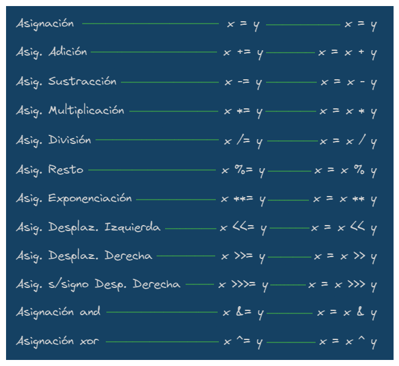
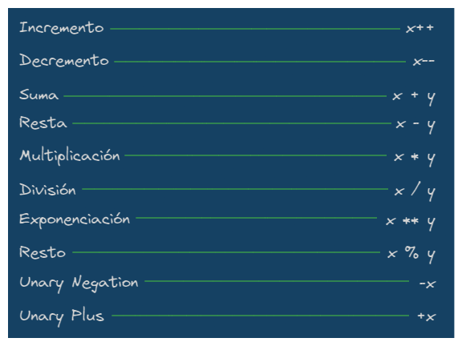
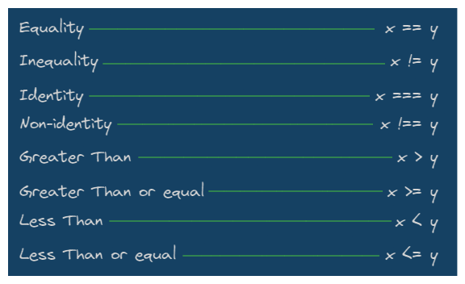
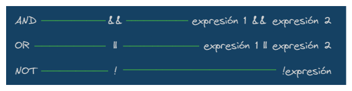

# **NIVEL JUNIOR**

---

## _Conceptos Basicos_

- **VARIABLE** ▶ es un espacio que se guarda en memoria de nuestro programa.

  - _Tipos de Datos Primitivos_
    - **STRING**
    - **NUMBER**
    - **BOOLEAN**
  - _Casos Especiales de Datos_
    - **UNDEFINED**
    - **NULL**
    - **NaN**

- **SCOPE** ▶ es el alcance de una variable en nuestro código.

- **HOISTING** ▶ término para describir que las declaraciones de variables y funciones son desplazadas a la parte superior del scope más cercano, scope global o de función.

- **FORMAS DE DECLARAR VARIABLE:**

  - _`var`_ palabra clave para declarar una variable mutable de manera global.
  - _`let`_ palabra clave para declarar una variable mutable por bloque.
  - _`const`_ palabra clave para declarar una variable inmutable.

## _Operadores de Asignación_

- Asigna un valor al operando de la izquierda basado en el valor del operando de la derecha

## _Operadores Aritméticos_

- Toman valores numéricos (ya sean literales o variables) como sus operandos y retornan un valor numérico único.

## _Operadores de Comparación_

- Comparan dos expresiones y devuelven un valor Boolean que representa la relación de sus valores.

## _Operadores Lógicos_

- Nos devuelven un resultado a partir de que se cumpla (o no) una condición, su resultado es booleano, y sus operadores son valores lógicos o asimilables a ellos.

## _Concatenación_

- Unir dos o más cadenas de texto.
- Para concatenar es usualmente con el signo `+`.
- Otra opción es usar el metodo `concat`.
- Y tambien se puede usar `backticks` y `${}` llamado `Template Strings`.

## _Condicionales_

- Nos permite validar, verificar si un bloque de codigo se ejecutará o no.
- Se tiene las siguientes condicionales:
  - `If` se ejecuta un bloque de codigo al cumplir la condición.
  - `Else` se ejecuta un bloque de codigo de no cumplirse la condición.
  - `Else-if` tiene varias opciones de condiciones lo que se puede ejecutar un bloque de codigo donde la condición se cumpla.

## _Arrays_

- Es una estructura de datos que sirve para almacenar elementos en un espacio de la memoria.
- Los arrays ya vienen hacer objetos no dato primitivo.
- Se crea el array poniendo entre `corchetes []` los elementos o usando el objeto `Array()`.
- Existen:
  - **ARRAYS**
  - **ARRAYS ASOCIATIVOS** | _`Objetos`_

## _Bucles_

- Los bucles son usados para realizar tareas repetitivas en base a una condición.
- Tenemos:
  - **WHILE** | crea un bucle que ejecuta una sentencia especificada, hasta que la condición se evalúa como falso.
  - **DO-WHILE** | aseguran que el codigo se ejecute por lo menos una vez y luego continua el bucle si la condición es true sino se detiene.
  - **FOR** | permite crear un bucle que se repetirá un número especificado de veces.
  - **FOR-IN** | itera sobre todas las propiedades enumerables de un objeto que está codificado por cadenas
  - **FOR-OF** | crea un bucle que se repite sobre objetos iterables

## _Funciones_

- Una función es un bloque de código o conjunto de instrucciones que realiza una tarea específica y puede reutilizarse a voluntad.
- Hay dos tipos de funciones:
  - **Funciones sin parametros** | no depende de variables para que la función se ejecute sin problemas.
  - **Funciones con parametros** | si depende de variables para que la función se ejecute sin problemas.
  - **Funciones con spread operator** | si depende de variables para que la función se ejecute sin problemas pero no tiene una cantidad definida de variables.

## _Programación Orientada a Objetos (POO)_

### Conceptos Basicos

- **Clase** | plantilla, fabrica de un objeto especifico.
- **Objeto** | resultados de las clases.
- **Atributo** | particularidades, caracteristicas del objeto.
- **Metodo** | cosas que puede hacer el objeto.
- **Constructor** | particularidad obligatoria de una clase.
- **Instanciación** | al terminar de crear una clase decimos que esta instanciada.

### Caracteristicas de la POO

- **Abstracción** | intentar reducir lo mas que se pueda el objeto a lo mas fundamental.
- **Modularidad** | separar todo por pedazos o modulos.
- **Encapsulamiento** | todo los datos sean privados, no obtenerlos tan sencillo.
- **Polimorfismo** | Como se comporta un objeto de manera distinta ante un mismo metodo.

### Otros conceptos de POO

- **Herencia** | hereda todas las propiedades y metodos de la clase padre.
- **Métodos Estáticos** | son los metodos que no necesitan las propiedades de lo heredado, y se pueden llamar sin crear un objeto de la clase.
- **Métodos Accesores (Getters, Setters)** | _`Getters:`_ son para obtener un valor, _`Setters:`_ son para modificar o definir un valor.

## _Métodos de Cadenas_

- Son acciones para el tratamiento de las cadenas de caracteres.
- Algunos metodos son:
  - `length` | muestra el total de caracteres de una cadena.
  - `concat()` | junta 2 o más cadenas y retorna una nueva.
  - `startsWith()` | si una cadena comienza con los caracteres de otra, devuelve true sino false.
  - `endsWith()` | si una cadena termina con los caracteres de otra, devuelve true sino false.
  - `includes()` | si una cadena se encuentra dentro de otra devuelve true sino false.
  - `indexOf()` | devuelve el indice del primer caracter de la cadena, si no existe devuelve -1.
  - `lastIndexOf()` | devuelve el ultimo indice del primer caracter de la cadena, si no existe devuelve -1.
  - `padStart()` | [propuesta de Estandar] - Rellenar cadena al principio con los caracteres deseados
  - `padEnd()` | [propuesta de ECMA] - Rellenar cadena al final con los caracteres deseados
  - `repeat()` | devuelve la misma cadena pero repetida la cantidad que le indiquemos
  - `split()` | divide la cadena como le pidamos y lo convierte array
  - `substring()` | nos retorna un pedazo de la cadena que seleccionamos
  - `toLowerCase()` | convierte una cadena a minúscula
  - `toUpperCase()` | convierte una cadena a mayúscula
  - `toString()` | método devuelve una cadena que representa al objeto especificado
  - `trim()` | elimina espacios en blancos al principio y al final de una cadena

## _Métodos de Arrays_

- Son acciones para el tratamiento de los arreglos o conjuntos de elementos.
- Metodos Mutables (consisten en cambiar el array original):
  - `pop()` | elimina el ultimo elemento del array y lo devuelve.
  - `shift()` | elimina el primer elemento del array y lo devuelve.
  - `push()` | agrega uno o más elementos al final del array y devuelve la nueva longitud del array.
  - `reverse()` | invierte el orden de los elementos del array.
  - `unshift()` | agrega uno o más elementos al inicio del array y devuelve la nueva longitud del array.
  - `sort()` | es mutable y consiste en ordenar un array a partir de los valores Unicode de los caracteres y este retorna un array con la misma referencia en memoria que el original.
  - `splice()` | cambia el contenido de un array eliminando elementos existentes y/o agregando nuevos elementos.
- Metodos Inmutables:
  - `join()` | es inmutable y consiste en crear un nuevo array a partir de la unión de otros valores o arrays especificados como argumentos.
  - `slice()` | devuelve una parte del array dentro de un nuevo array empezando por inicio hasta fin (fin no incluido).
  - `filter()` | consiste en crear un nuevo array a partir de los elementos originales filtrados mediante una función (callback) que indica la condición a cumplir y es inmutable.
  - `forEach()` | consiste en ejecutar una función (callback) para cada uno de los elementos iterados.
  - `map()` | consiste en crear un nuevo array a partir de los elementos originales transformados mediante una función (callback) y es inmutable (no modifica el array original).
  - `reduce()` | es inmutable y consiste retornar un solo valor del array iterado a partir de una función (callback) que indica de qué manera se itera cada elemento para reducirlo.
  - `some()` | inmutable y consiste retornar un valor lógico verdadero si existe al menos un elemento que cumpla la condición establecida en la función (callback).
  - `every()` | inmutable y consiste retornar un valor lógico verdadero si todos los elementos cumplen con la condición establecida en la función (callback).
  - `find()` | consiste en encontrar el valor del primer elemento de un array que cumpla con la condición especificada en la función (callback).
  - `findIndex()` | consiste en encontrar el indice del primer elemento de un array que cumpla con la condición especificada en la función (callback).
  - `flat()` | es inmutable y consiste en retornar un array donde los sub-arrays han sido aplanados hasta una profundidad especificada. El aplanamiento consiste en transformar un array de arrays a una sola dimensión.
  - `flatMap()` | es inmutable y consiste en la combinación de los métodos map y flat. Primero realiza la iteración de los elementos del array (como si fuera map), y después los aplana en una sola profundidad (como si fuera flat).
  - `length` | muestra el total de elementos de un array.
  - `concat()` | une 2 arrays en 1.
  - `toString()` | convierte el arreglo en string.
  - `indexOf()` | muestra el indice del elemento indicado a buscar sino retorn -1.
  - `lastIndexOf()` | hace lo mismo que indexOf() pero busca de derecha a izquierda.
  - `includes()` | verifica si el o los elementos estan en el array retorna true sino false.

## _Objeto Math_

- Math es uno de los objetos globales u objeto incorporado estándar de JavaScript.

### Metodos

- `sqrt()` | devuelve la raiz cuadrada positiva de un numero.
- `cbrt()` | devuelve la raiz cubica de un numero.
- `max()` | devuelve el mayor de cero o más números.
- `min()` | devuelve el menor de cero o más números.
- `random()` | devuelve un numero pseudo-aleatorio entre 0 y 1.
- `round()` | devuelve el valor de un numero redondeado al numero entero mas cercano.
- `fround()` | devuelve la representacion flotante de precision simple mas cercana de un numero.
- `floor()` | devuelve el mayor entero menor que o igual a un numero.
- `trunc()` | devuelve la parte entera del numero x, la eliminacion de los digitos fraccionarios.

### Propiedades

- `PI` | radio de la circunsferencia de un circulo respecto a su diametro, aprox. 3.14159
- `SQRT1_2` | raiz cuadrada de 1/2, equivalentemente, 1 sobre la raiz cuadrada de 2, aprox. 0.707
- `SQRT2` | raiz cuadrada de 2, aprox. 1.414
- `E` | constante de Euler, base de los logaritmos naturales, aprox.
- `LN2` | logaritmo natural de 2, aprox. 0.693
- `LN10` | logaritmo natural de 10, aprox. 2.303
- `LOG2E` | logaritmo de E con base 2, aprox. 1.443
- `LOG10E` | logaritmo de E con base 10, aprox. 0.434

## _Console_

### Funciones de Registro

- `assert()` | aparece un mensaje de error en la consola si la afirmacion es falsa. Si la afirmacion es verdadera, no aparecerá nada. (NO ESTANDAR)
- `clear()` | limpia la consola
- `error()` | muestra un mensaje de error en la consola web
- `info()` | emite un mensaje informativo a la consola web. En Firefox y Chrome, se muestra un pequeño ícono "i" junto a estos elementos en el registro de la consola web
- `log()` | muestra un mensaje en la consola web (o del interprete JavaScript)
- `table()` | esta funcion toma un argumento obligatorio: data, que debe ser un array o un objeto y un parametro adicional: columns y nos muestra una tabla en consola
- `warn()` | imprime un mensaje de advertencia en la consola web
- `dir()` | despliega una lista interactiva de las propiedades del objeto JavaScript especificado. [NO ESTANDAR]

### Funciones de Conteo

- `count()` | registra el numero de veces que se llama a count(). Esta funcion toma como argumento opcional una etiqueta
- `countReset()` | resetea el contador console.count()

### Funciones de Agrupación

- `group()` | crea un nuevo grupo en linea en el registro de la consola web
- `groupEnd()` | remueve un grupo en linea en el registro de la consola web
- `groupCollapsed()` | crea un grupo en linea pero contraido, el usuario debe expandirlo para verlo

### Funciones de Temporizacion

- `time()` | inicia un temporizador
- `timeEnd()` | registra el valor actual de un temporizado
- `timeLog()` | detiene un temporizador

## _Document Object Model (DOM)_

- El DOM es una interfaz de programación que nos permite crear, cambiar, o remover elementos del documento. También podemos agregar eventos a esos elementos para hacer más dinámica nuestra página.

- **Nodo** | en el DOM es cualquier etiqueta del cuerpo, como un párrafo, el mismo body o incluso las etiquetas de una lista.

  - `Document` | el nodo document es el nodo raíz, a partir del cual derivan el resto de nodos.
  - `Element` | nodos definidos por etiquetas HTML.
  - `Text` | es texto dentro de un nodo element se considera un nuevo nodo hijo de tipo text.
  - `Attribute` | son atributos de las etiquetas definen nodos, (en JavaScript no los veremos como nodos, sino como información asociada al nodo tipo element).
  - `Comentarios y otros` | los comentarios y otros elementos como las declaraciones doctype en cabecera de los documentos HTML generan nodos.

- **Metodos de Selección de Elementos** | son todos los metodos que nos van a permitir obtener los elementos o grupos de elementos que deseemos seleccionar.

  - `getElementById()` | selecciona un elemento por su ID.
  - `getElementsByTagName()` | selecciona todos los elementos que coincidan con el nombre de la etiqueta especificada.
  - `querySelector()` | devuelve el primer elemento que coincida con el grupo especificado de selectores.
  - `querySelectorAll()` | devuelve todos los elementos que coincidan con el grupo especificado de selectores.

- **Metodos de Atributos de un Elemento** | son metodos usados para definir, obtener y eliminar valores de atributos de un elemento.

  - `setAttribute()` | modifica el valor de un atributo.
  - `getAttribute()` | obtiene el valor de un atributo.
  - `removeAttribute()` | remueve el valor de un atributo.

- **Atributos Globales** | son los atributos que tienen todos los elementos.

  - `class` | lista de clases del elemento separadas por espacios.
  - `contenteditable` | indica si el elemento puede ser modificable por el usuario (bool).
  - `dir` | indica la direccionalidad del texto.
  - `hidden` | indica si el elemento aun no es, o ya no es, relevante.
  - `id` | define un identificador único.
  - `style` | contiene declaraciones de estilo CSS para ser aplicadas al elemento (las propiedades en camel case).
  - `tabindex` | indica si el elemento puede obtener un focus de input.
  - `title` | contiene un texto con información relacionada al elemento al que pertenece.

- **Atributos de Inputs** | atributos para los elementos inputs.

  - `className`
  - `value`
  - `type`
  - `accept`
  - `form`
  - `minlength`
  - `placeholder`
  - `required`

- **Atributo Style** | permite modificar algo del css del elemento.

- **Clases, classList y Metodos de classList**

  - `add()` | añade una clase.
  - `remove()` | remueve una clase.
  - `item()` | devuelve la clase del indice especificado.
  - `contains()` | verifica si ese elemento posee o no, la clase especificada.
  - `replace()` | reemplaza una clase por otra.
  - `toggle()` | si no tiene la clase especificada, la agrega, si ya la tiene, la elimina.

- **Obtención y Modificación de Elementos**

  - `textContent` | devuelve el texto de cualquier nodo.
  - `innerHTML` | devuelve el contenido HTML de un elemento.
  - `outerHTML` | devuelve el codigo HTML completo del elemento.
  - NOTA:
    `innerText(ya no se usa ni recomienda)` | devuelve el texto visible de un node element.

- **Creación de Elementos**

  - `createElement()` | crea un elemento, poner la etiqueta en mayuscula.
  - `createTextNode()` | crea un text node. Es un objeto.
  - `appendChild()` | añade un elemento a otro elemento volviendo al primer elemento hijo del segundo.
  - `createDocumentFragment()` | agrupa elementos para luego usarlos donde desees.

- **Obtención y Modificación de Childs (Hijos)**

  _CUENTAN LOS ESPACIOS EN BLANCOS Y ETIQUETAS COMO HIJOS_

  - `firstChild` | devuelve el primer hijo.
  - `lastChild` | devuelve el ultimo hijo.
  - `childNodes` | devuelve todos los nodos hijos.

  _CUENTAN SOLO LAS ETIQUETAS COMO HIJOS_

  - `firstElementChild` | devuelve el primer elemento hijo.
  - `lastElementChild` | devuelve el ultimo elemento hijo.
  - `children` | devuelve todos los elementos hijos.

- **Metodos de Childs (Hijos)**

  - `replaceChild()` | reemplaza un elemento hijo por otro nuevo.
  - `removeChild()` | remueve el elemento hijo que no querramos.
  - `hasChildNodes()` | verifica si tiene un elemento hijo o no. Si tiene dara true sino false.

- **Propiedades de Parents (Padres)**

  _Busca el elemento padre (Etiqueta)_

  - `parentElement` | selecciona el padre elemento de un elemento.

  _Busca el node padre (Etiqueta u otros)_

  - `parentNode` | selecciona el padre node de un elemento.

- **Propiedades de Siblings (Hermanos)**

  _CUENTA LOS ESPACIOS EN BLANCOS Y ETIQUETAS COMO HERMANOS_

  - `nextSibling` | devuelve el hermano siguiente.
  - `previousSibling` | devuelve el hermano anterior.

  _CUENTA SOLO LAS ETIQUETAS COMO HERMANOS_

  - `nextElementSibling` | devuelve el elemento hermano siguiente.
  - `previousElementSibling` | devuelve el elemento hermano anterior.

- **Nodos - Una Propiedad Extra**

  - `closest()` | selecciona el elemento ascendente mas cercano que coincida con nuestro selector.

---
