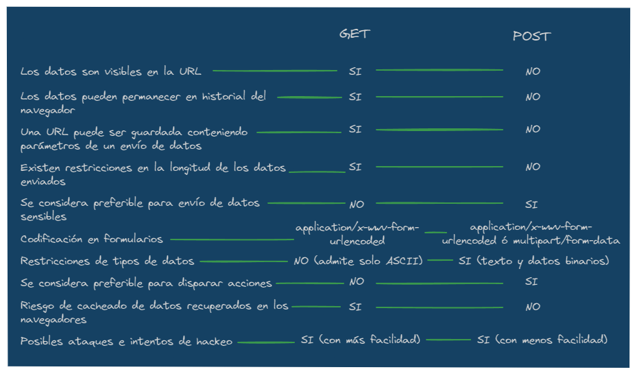

# **NIVEL MID LEVEL**

---

## _OBJETO WINDOW_

- Es el objeto de más alta jerarquia de JavaScript
- Hereda las propiedades de EventTarget
- Los Métodos más usados son:

  - `open()` | carga un recurso en el contexto de un nuevo navegador o uno que ya existe.
  - `close()` | cierra la ventana actual, o la ventana en la que se llamó.
  - `closed` | indica si la ventana referenciada está cerrada o no.
  - `stop()` | detiene la carga de recursos en el contexto de navegación actual.
  - `alert()` | muestra un cuadro de alerta con el contenido especificado y un botón aceptar.
  - `print()` | abre el cuadro de dialogo imprimir para imprimir el documento actual.
  - `prompt()` | abre un cuadro de dialogo con un mensaje que solicita al usuario un dato (string).
  - `confirm()` | abre un cuadro de dialogo con un mensaje y dos botones: aceptar y cancelar.

- Métodos de Screen y Scroll:

  - `screen` | devuelve una referencia al objeto de pantalla asociado con la ventana.
  - `screenLeft` | devuelve la distancia horizontal entre el borde izquierdo del navegador y el borde izquierdo de la pantalla.
  - `screenTop` | devuelve la distancia vertical entre el borde superior del navegador y el borde superior de la pantalla.
  - `scrollX` | devuelve el número de pixeles que el documento se desplaza actualmente horizontal.
  - `scrollY` | devuelve el número de pixeles que el documento se desplaza actualmente vertical.
  - `scroll()` | desplaza la ventana a un lugar particular en el documento (con options y posiciones).

  - `resizeBy()` | cambia el tamaño de la ventana actual en una cantidad específica.
  - `resizeTo()` | redimensiona dinámicamente la ventana.
  - `moveBy()` | mueve la ventana en una ubicación relativa.
  - `moveTo()` | mueve la ventana en una ubicación absoluta.

- Objetos Barprop:

  - `locationbar`
  - `menubar`
  - `personalbar`
  - `scrollbars`
  - `statusbar`
  - `toolbar`

- Location:

  - `window.location.href` | devuelve el href (URL) de la página actual.
  - `window.location.hostname` | devuelve el nombre de dominio del servidor web.
  - `window.location.pathname` | devuelve la ruta y el nombre de archivo de la página actual.
  - `window.location.protocol` | devuelve el protocolo web utilizado (http: o https:).
  - `window.location.assign()` | carga un nuevo documento.

## _HERRAMIENTAS DE DESARROLLO DEL NAVEGADOR_

- **Pestaña Elements**

  - Filtros y buscar por palabra claves
  - Modificar, crear y eliminar etiquetas
  - Modificar propiedades de CSS
  - Event Listenners
  - Properties
  - Opciones para copiar
  - Seguir explorando

- **Pestaña Resource/Source**

  - Ver y guardar archivos
  - Información ofrecida
  - Cambios en tiempo real
  - Snippets - Ejecutar codigo por fragmentos

- **Pestaña Networks**

  - Interfaz
  - Sort By y Filtros de busqueda
  - Limpiar cookies y caché
  - Importar y Exportar

- **Pestaña Timeline/Performance**

  - Uso y grabación
  - Screenshots de la grabación
  - Controls
  - Overview | `FPS, CPU y Net`
  - Flane Chart
  - Details
  - Sugerencias de grabación

- **Pestaña Application**

  - Application
  - Storage
  - Caché
  - Backgrounnd Services
  - Frames

## _EVENTOS_

- Son cualquier cambio o suceso que ocurra en un sitio web
- De manera individual no son utiles pero cambia al usarlo en elementos de HTML

### Event Handlers

- Es un delegado predefinido que representa específicamente un método de controlador de eventos que no genera datos. Este no se ejecuta cuando desactivan el `JavaScript` en el navegador.

### Event Listeners

- Es un escuchador que indica al navegador que esté atento a la interacción del usuario.

### Objeto Event

- Objeto que almacena información sobre un evento y es pasado, para cada evento que tiene lugar, como argumento a la función o funciones que gestionan el evento.

### Event Flow

- `Event Bubbling` | sucede cuando se ejecuta un evento y este se propaga a sus elementos padres, osea a sus predecesores, transmitiiendo la ejecución del evento del más especifico al menos especifico.

- `Event Capturing` | nos referimos al proceso contrario al de event bubbling. Es decir, que ejecuta el evento menos especifico al más especifico. Agregando un tercer parametro booleano.

### StopPropagation

- Pausa o detiene la propagación de eventos, haciendo que solo se ejecute el elemento más especifico.

### Mouse Events

- Representa eventos que ocurren debido a que el usuario interactúa con un dispositivo señalador (como un mouse).

  ♦ `click` | ocurre al dar un click

  ♦ `dblclick` | ocurre al dar doble click

  ♦ `mouseover` | ocurre cuando el puntero se mueve sobre un elemento o uno de sus hijos

  ♦ `mouseout` | ocurre cuando se mueve el puntero fuera de un elemento o de sus elemento secundarios

  ♦ `contextmenu` | ocurre con un click derecho en un elemento para abrir un menú contextual

  ♦ `mouseenter` | ocurre cuando el puntero se mueve sobre un elemento

  ♦ `mouseleave` | ocurre cuando el puntero se mueve fuera de un elemento

  ♦ `mouseup` | ocurre cuando un usuario suelta un boton del mouse sobre un elemento

  ♦ `mousemove` | ocurre cuando el puntero se mueve mientras está sobre un elemento

### Key Events

- Se ejecuta en una interacción del usuario con el teclado. Cada evento describe una tecla; el tipo de evento( keydown , keypress , o keyup ) identifica el tipo de acción realizada.

♦ `keypress` | ocurre cuando una tecla se presiona

♦ `keydown` | ocurre cuando una tecla se deja de presionar

♦ `onkeyup` | ocurre despues de que los eventos anteriores hayan concluido consecutivamente

### Interface Events

♦ `error` | ocurre cuando sucede un error durante la carga de un archivo multimedia

♦ `load` | ocurre cuando un objeto se ha cargado

♦ `beforeunload` | ocurre antes de que el documento esté a punto de descargarse

♦ `unload` | ocurre una vez que se ha descargado una página

♦ `resize` | ocurre cuando se cambia el tamaño de la vista del documento

♦ `scroll` | ocurre cuando se desplaza la barra de desplazamiento de un elemento

♦ `select` | ocurre después de que el usuario selecciona algún texto de `<input>` o `<textarea>`

### Timers (Temporizadores)

♦ `setTimeout()`

♦ `setInterval()`

♦ `clearTimeout()`

♦ `clearInterval()`

## _CONTROL DE FLUJOS Y MANEJO DE ERRORES_

### Sentencias de Bloque

- Se utiliza para agrupar cero o mas sentencias
- Se delimita por un par de llaves

### Sentencias de Control de Flujo

- Son instrucciones que nos permiten evaluar si se puede o no cumplir una condición
- Incluso nos puede ayudar a evaluar "n" cantidad de veces

### Sentencias de Manejo de Excepciones

- Cuando ocurre un error, JavaScript crea un `objeto error` con dos propiedades: _nombre_ y _mensaje_
- Entonces se dice que JavaScript lanza una excepción

### Sentencia Switch

- Evalúa una expresión comparando el valor de esa expresión con una instancia case
- Ejecuta declaraciones asociadas a ese case, así las declaraciones en los case que siguen
- No muy usado actualmente

### Try & Catch

- Marca un bloque de instrucciones a intentar que pueden causar alguna excepción
- Declara una o más respuestas en caso de que una excepción sea arrojada
- Si una excepción es arrojada, la sentencia `try-catch` se encarga de atraparla

### Finally

- Es un bloque que se ejecuta despues del bloque try y el/los bloque(s) catch hayan fializado su ejecución
- Este bloque siempre se ejecuta, independiente de si una excepción fue lanzada o capturada

### Sentencia Throw

- Crea o lanza una excepción que se puede manejar en catch como el error

## _LO OBSOLETO DE JAVASCRIPT_

### ¿ Cuando algo se vuelve obsoleto ?

- Cuando la documentacion indica `Deprecated`
- Cuando es inútil porque ya no existe, se elimino del lenguaje
- Cuando ya no recomendado por algun motivo
- Cuando tiene bugs o fallos
- Cuando está por ser reemplazado (Deprecated)
- Cuando hay mejores formas de hacerlo

#### 📍 Los Efectos Negativos (aplicado a metodos, clases y propiedades)

- Uso excesivo de recursos
- Código con bugs o fallos
- Código innecesariamente largo
- SEO (la pagina web detecta errores u otros motivos)

#### 📍 ¿ Cómo verificar si está obsoleto ?

- 1 de cada 3 webs utiliza librerias de javascript obsoletas
- Verificar si tienen o usan funciones, metodos, objetos o metodologias obsoletas
- Verificar en los sitios basados en estandares oficiales

### Detectar navegadores obsoletos

- Detección del navegador y cobertura a múltiples navegadores (buscar en google)

## _CALLBACKS_

- Función que se pasa a otra función como un argumento, que luego se invoca dentro de la función externa para completar algún tipo de rutina o acción

## _PROMESAS_

- Es un objeto que representa un valor que puede estar disponible ahora, en el futuro o nunca
- Esta representación encapsula el resultado (éxito o error) de una operación asíncrona

## _AWAIT & ASYNC_

- Funciona con código basado en `Promesas`, pero oculta las promesas para que la lectura sea más fluida y sencilla de entender
- La expresión `await` provoca que la ejecución de una función `async` sea pausada hasta que una `promesa` sea terminada o rechazada, y regresa a la ejecución de la función async despues del término

## _PETICIONES HTTP_

- Una petición HTTP es como suele denominarse a la acción por parte del navegador de solicitar a un servidor web un documento o archivo
- Este doumento o archivo ya sea fichero `.html`, una imagen, tipografía, etc

## _DATOS ESTRUCTURALES (JSON)_

- JSON | JavaScript Object Notation
- Es el formato de intercambio de datos que lo hace posible
- JSON es un formato de datos muy popular para desarrolladores debido a su texto legible, ligero, requiere menos codificación y procesa más rápido al no requerir deserialización
- Se puede Serializar y Deserializar un JSON
- JSON `deserializado` es de tipo _`objeto`_ y `serializado` es un _`string`_

### Metodos Importantes

- `parse()` | convierte un string con estructura JSON a formato JSON (deserializar)
- `stringify()` | convierte un dato de JavaScript en una cadena de texto JSON (serializar)

## _AJAX_

- AJAX | Asynchronous JavaScript And XML
- Es una práctica de programación utilizada para construir páginas web más complejas y dinámicas, utilizando una tecnología conocida como `XMLHttpRequest`
- AJAX no es soportado por todos los navegadores por lo que en esos casos nos ayuda `ActiveXObject`

### Objeto XMLHtpRequest

- Es un objeto para peticionar
- Hace peticiones _GET_, _POST_, _DELETE_, _UPDATE_, etc

## _FETCH_

- Mecanismo que permite realizar llamadas `AJAX` simples con JavaScript.
- Fetch puede usarse para realizar llamadas a una API externa sin tener que detener la ejecución de otras instrucciones

### Metodos usados en Fetch

- `text()` | convierte la data obtenida de una peticion en texto
- `json()` | convierte la data obtenida de una peticion en JSON
- `blob()` | convierte la data obtenida de una peticion en ficheros de datos planos inmutables
- `formData()`
- `arrayBuffer()`

## _AXIOS_

- Es un cliente HTTP simple basado en promesas para el navegador y Node.js
- Provee una libreria fácil de usar en un paquete pequeño con una interfaz muy extensible

## _DIFERENCIA ENTRE GET Y POST_

---
